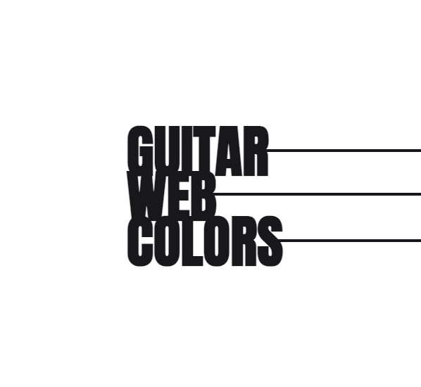

<p align="center"></p>

<div align="center">

<a href="">[](https://codesandbox.io/p/github/kevinsilva/guitarWC/csb-guitarWC?file=%2FREADME.md)</a>

</div>

A quiz game to guess the RGB colors of the guitar.

In 10 rounds, the user is asked to guess the rgb value of the color displayed on the guitar. Choosing the correct value between three options will add 10 points to the score. 

## Implementation Details

This project started by determining the rules for this game, naming the constituent elements and defining the separation of concerns. After designing the interface, the game was developed with both a functional approach, and a object oriented (oop) class approach. 

Since the main concept takes inspiration from guitar colors, the monochromatic interface was designed on [Figma](https://www.figma.com/) with the clear intention as to make the guitar color pop. I resorted to HTML and [Tailwind](https://tailwindcss.com/) to program the interface with static elements, making the usability as simple as possible.

Both programming paradigms used, support a clear distinction between the rendering of the dynamic elements of the page, and the business logic of the game. The development environment of [Vite](https://vitejs.dev/), allowed me to easily add [jQuery](https://jquery.com/) in modules, testing the units with [Vitest](https://vitest.dev/). By taking the random generator of the guitar colors as the most basic functionality, it allowed for the formation of questions and the establishment of the color to be displayed. Essentially, there are four different screens: the start screen, the ask screen, the answer screen, and the end screen. Each screen renders the state to the elements. The click events update the state and compute the logic.
 
## Usage

Import either the `game.js` class module from `./src/Game.js`, or the `functional.js` module from `./src/functional/functional.js`. 

```js
<script src="./src/Game.js" type="module"></script>
```

```js
<script src="./src/functional/functional.js" type="module"></script>
```

To access the DOM references on the `functional.js` module, check the top variable assignments. 

```js
// SCREENS
const startScreenID = '#start-screen';
const askScreenID = '#ask-screen';
const answerScreenID = '#answer-screen';
const endScreenID = '#end-screen';
// BUTTONS
const newGameBtnID = '#new-game';
const answerBtnsID = ['.button-0', '.button-1', '.button-2'];
const nextQuestionBtnID = '#next-question';
const restartGameBtnID = '#restart-game';
// TEXTS
const questionTxtID = '#question';
const roundTxtID = 'h3.round';
const answerTxtID = '#answer';
const pointsTxtID = 'h3.points';
const endMessageTxtID = '#end-message';
const endScoreTxtID = '#end-score';
// GUITAR
const guitarID = 'svg.guitar-body';
```

Go to inherent screen class to access it's class elements. For example:

```js
class AskElements {
  constructor() {
    this.screenID = '#ask-screen';
    this.roundTxtID = 'h3.round';
    this.pointsTxtID = 'h3.points';
    this.questionTxtID = '#question';
    this.guitarID = 'svg.guitar-body';
    this.answerBtnsID = [
      'button.button-0',
      'button.button-1',
      'button.button-2',
    ];
  }
}
```
> **! Note**
>
> Production build on the dist folder.


## Development

To install the component, clone repository, change into directory on the terminal and install with npm.

```bash
git clone https://github.com/kevinsilva/guitarWC
cd guitarWC
npm install
```

To run the application.

```bash
  npm run dev
```

To run the tests.

```bash
  npm run test
```

## Credits

Big thanks to my mentor 🎓, [William R. J. Ribeiro](https://github.com/williamrjribeiro/).

Guitar designed by [Freepik](http://www.freepik.com). Colors by [Fender](http://www.fender.com) and [Gibson](http://gibson.com)

## Licence

[MIT](https://choosealicense.com/licenses/mit/)
