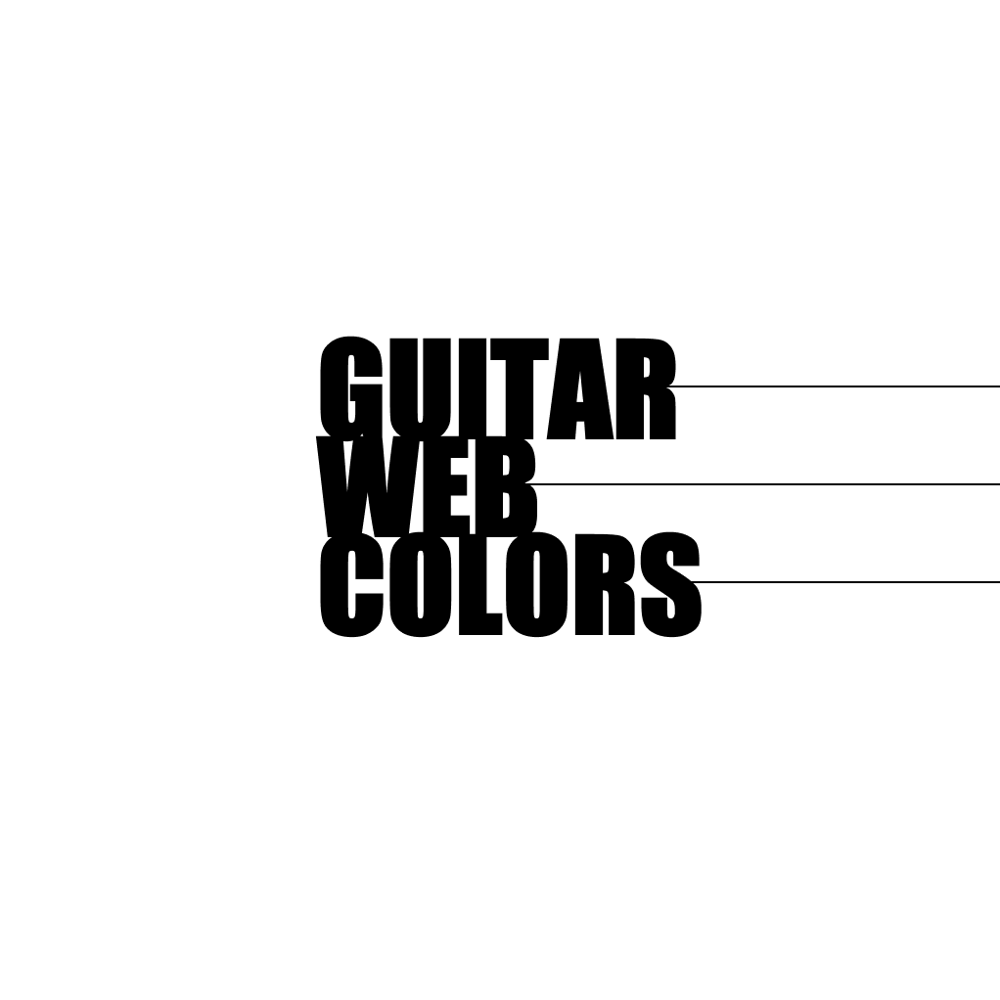

<p align="center"></p>

<div align="center">

<a href="">[](https://codesandbox.io/p/github/kevinsilva/recursive-calculator/csb-recursive?file=%2FREADME.md)</a>

</div>

## Guitar Web Colors

A quiz game where you guess the RGB color of the guitar displayed on the page.

## Implementation Details

This project explores both a functional and Object Oriented Programming approach.

## Usage

## Development

To install the component, clone repository, change into directory on the terminal and install with npm.

```bash
git clone https://github.com/kevinsilva/
cd guitarWC
npm install
```

To run the application.

```bash
  npm run dev
```

To run the tests.

```bash
  npm run test
```

## Credits

Big thanks to my mentor 🎓, [William R. J. Ribeiro](https://github.com/williamrjribeiro/).

Guitar designed by [Freepik](http://www.freepik.com). Colors by [Fender](http://www.fender.com) and [Gibson](http://gibson.com)

## Licence

[MIT](https://choosealicense.com/licenses/mit/)
